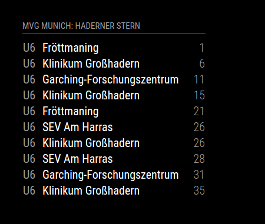
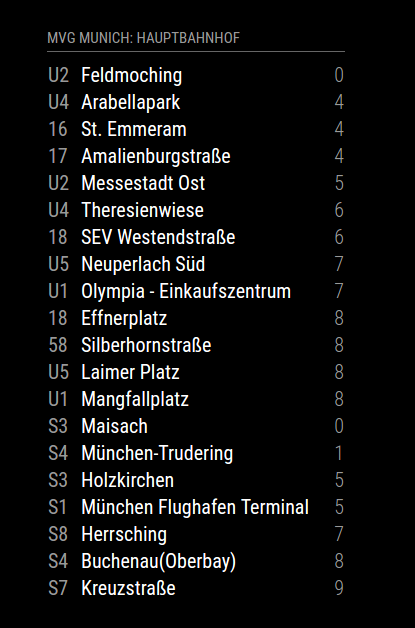

# MMM-mvgmunich [](https://github.com/mrVragec/MMM-mvgmunich/raw/master/LICENSE) [](https://travis-ci.org/mrVragec/MMM-mvgmunich) [](https://snyk.io/test/github/mrvragec/mmm-mvgmunich) [](https://codeclimate.com/github/mrVragec/MMM-mvgmunich)

MagicMirror² Module to monitor public transport (U-bahn, tram, bus, S-Bahn) in Munich - Germany. 

## Example
 

## Dependencies
* instance of [MagicMirror²](https://github.com/MichMich/MagicMirror)
* cheerio & array-filter (linux: npm install cheerio && npm install array-filter)

## Installation
1. Clone this repository in your MagicMirror installation under modules.
2. Rename plugin foler from 'MMM-mvgmunich' to 'mvgmunich'
3. Install dependencies in main MagicMirror folder 
4. Add configuration block to your config.js:
```
{
  module: "mvgmunich",
  position: "bottom_left",
  header: "MVG",
    config: {
      haltestelle: "Hauptbahnhof",
      maxEntries: 25,   // 10 items on screen
      updateInterval: 60000,  // 60 s
      showUbahn: true,    //show ubahn route
      showBus: true,    // show bus route
      showTram: true,   // show tram route
      showSbahn: true   // show sbahn route
      ignoreStations: [] // destination not to be shown
      timeToWalk: 10 // 10 min walking time to station. Default is 0
      includeWalkingTime: false // if the walking time should be included and the starting time is displayed
    }
},
```

## Config Options
| **Option** | **Description** |
| --- | --- |
| `haltestelle` | Station for which you want to display data. <br> **Default:** `Hauprbanhof` <br> **Source:** http://www.mvg-live.de/MvgLive/MvgLive.jsp |
| `maxEntries` | Number of items shown in table. <br> **Default:** `8` |
| `updateInterval` | Update interval <br> **Default:** `60000` |
| `showUbahn` | Show data for U-Bahn. <br> **Possible values:** `true` or `false` <br> **Default:** `true` |
| `showBus` |Show data for Bus. <br> **Possible values:** `true` or `false` <br> **Default:** `true` |
| `showTram` |Show data for Tram. <br> **Possible values:** `true` or `false` <br> **Default:** `true` |
| `showSbahn` |Show data for S-Bahn. <br> **Possible values:** `true` or `false` <br> **Default:** `true` |
| `ignoreStations` |Ignore destinations based on a array list. <br> **Possible values e.g.:** `["Feldmoching", "Hauptbahnhof"]` <br> **Default** `[]` |
| `timeToWalk` | Time to walk to the station from your current location <br> **Default:** `0` minutes |
| `includeWalkingTime` | If the time to leave should be displayed which includes the walking time. <br> **Default:** `false` |