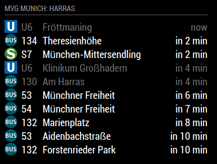
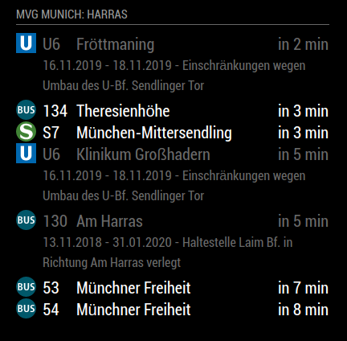

# MMM-mvgmunich [](https://github.com/mrVragec/MMM-mvgmunich/raw/master/LICENSE) [](https://travis-ci.org/mrVragec/MMM-mvgmunich) [](https://snyk.io/test/github/mrvragec/mmm-mvgmunich) [](https://codeclimate.com/github/mrVragec/MMM-mvgmunich)

MagicMirror² Module to monitor public transport (U-bahn, tram, bus, S-Bahn) in Munich - Germany.

## Example

|     |     |
| --- | --- |
|  **Stations names with arrival time**  |  | 
```
config: {
    haltestelle: "Hauptbahnhof",
    maxEntries: 10,             // 10 items on screen
    updateInterval: 60000,      // 60 s
    showIcons: false,            // Show transport type icon
    transportTypesToShow: {
      "ubahn": true,            // show ubahn route
      "sbahn": false,            // show sbahn route
      "bus": false,              // show bus route
      "regional_bus": false,     // show regional bus route
      "tram": false              // show tram route
    },
    ignoreStations: [],         // destination not to be shown
    timeToWalk: 0,             // 10 min walking time to station. Default is 0
    showWalkingTime: false,     // if the walking time should be included and the starting time is displayed
    showTrainDepartureTime: true,     // show tran departure time
    trainDepartureTimeFormat: "relative",   // format of the train departure time
    walkingTimeFormat: "relative",    // format of the walking time
  }
```
|     |     |
| --- | --- |
| **Stations names with icons and arrival time** |  |

```
config: {
  haltestelle: "Karlsplatz",
  maxEntries: 15,             // 10 items on screen
  updateInterval: 60000,      // 60 s
  showIcons: true,            // Show transport type icon
  transportTypesToShow: {
    "ubahn": true,            // show ubahn route
    "sbahn": true,            // show sbahn route
    "bus": false,              // show bus route
    "regional_bus": false,     // show regional bus route
    "tram": true              // show tram route
  },
  ignoreStations: [],         // destination not to be shown
  timeToWalk: 0,             // 10 min walking time to station. Default is 0
  showWalkingTime: true,     // if the walking time should be included and the starting time is displayed
  showTrainDepartureTime: true,     // show tran departure time
  trainDepartureTimeFormat: "relative",   // format of the train departure time
  walkingTimeFormat: "relative"    // format of the walking time
}
```
|     |     |
| --- | --- |
|  **Stations names with icons, arrival time and walking time** |  |
```
config: {
  haltestelle: "Karlsplatz",
  maxEntries: 15,             // 10 items on screen
  updateInterval: 60000,      // 60 s
  showIcons: true,            // Show transport type icon
  transportTypesToShow: {
    "ubahn": true,            // show ubahn route
    "sbahn": true,            // show sbahn route
    "bus": true,              // show bus route
    "regional_bus": false,     // show regional bus route
    "tram": true              // show tram route
  },
  ignoreStations: [],         // destination not to be shown
  timeToWalk: 0,             // 10 min walking time to station. Default is 0
  showWalkingTime: true,     // if the walking time should be included and the starting time is displayed
  showTrainDepartureTime: true,     // show tran departure time
  trainDepartureTimeFormat: "absolute",   // format of the train departure time
  walkingTimeFormat: "relative"    // format of the walking time
}
```

|     |     |
| --- | --- |
| **Stations names with icons, arrival time and disruption marking** |  |
```
config: {
  haltestelle: "Harras",
  maxEntries: 10,             // 10 items on screen
  updateInterval: 60000,      // 60 s
  showIcons: true,            // Show transport type icon
  transportTypesToShow: {
    "ubahn": true,            // show ubahn route
    "sbahn": true,            // show sbahn route
    "bus": true,              // show bus route
    "regional_bus": false,     // show regional bus route
    "tram": false              // show tram route
  },
  ignoreStations: [],         // destination not to be shown
  timeToWalk: 0,             // 10 min walking time to station. Default is 0
  showWalkingTime: false,     // if the walking time should be included and the starting time is displayed
  showTrainDepartureTime: true,     // show tran departure time
  trainDepartureTimeFormat: "absolute",   // format of the train departure time
  walkingTimeFormat: "relative",    // format of the walking time
  showInterruptions: true,
  showInterruptionsDetails: false,
  countInterruptionsAsItemShown: false
```

|     |     |
| --- | --- |
| **Stations names with icons, arrival time, disruption marking and disruptions details** (disruption details are not counted as new lines)|  |
```
config: {
  haltestelle: "Harras",
  maxEntries: 10,             // 10 items on screen
  updateInterval: 60000,      // 60 s
  showIcons: true,            // Show transport type icon
  transportTypesToShow: {
    "ubahn": true,            // show ubahn route
    "sbahn": true,            // show sbahn route
    "bus": true,              // show bus route
    "regional_bus": false,     // show regional bus route
    "tram": false              // show tram route
  },
  ignoreStations: [],         // destination not to be shown
  timeToWalk: 0,             // 10 min walking time to station. Default is 0
  showWalkingTime: false,     // if the walking time should be included and the starting time is displayed
  showTrainDepartureTime: true,     // show tran departure time
  trainDepartureTimeFormat: "absolute",   // format of the train departure time
  walkingTimeFormat: "relative",    // format of the walking time
  showInterruptions: true,
  showInterruptionsDetails: true,
  countInterruptionsAsItemShown: false
```

|     |     |
| --- | --- |
| **Stations names with icons, arrival time, disruption marking and disruptions details** (disruption details are counted as new lines) |  |
```
config: {
  haltestelle: "Harras",
  maxEntries: 10,             // 10 items on screen
  updateInterval: 60000,      // 60 s
  showIcons: true,            // Show transport type icon
  transportTypesToShow: {
    "ubahn": true,            // show ubahn route
    "sbahn": true,            // show sbahn route
    "bus": true,              // show bus route
    "regional_bus": false,     // show regional bus route
    "tram": false              // show tram route
  },
  ignoreStations: [],         // destination not to be shown
  timeToWalk: 0,             // 10 min walking time to station. Default is 0
  showWalkingTime: false,     // if the walking time should be included and the starting time is displayed
  showTrainDepartureTime: true,     // show tran departure time
  trainDepartureTimeFormat: "absolute",   // format of the train departure time
  walkingTimeFormat: "relative",    // format of the walking time
  showInterruptions: true,
  showInterruptionsDetails: true,
  countInterruptionsAsItemShown: true
```

## Dependencies
* instance of [MagicMirror²](https://github.com/MichMich/MagicMirror)
* urlencode (linux: npm install urlencode)

## Installation
1. Clone this repository in your MagicMirror installation into the folder modules.
2. Rename plugin foler from 'MMM-mvgmunich' to 'mvgmunich'
3. Install dependencies in main MagicMirror folder
4. Add configuration block to your config.js:
```
{
  module: "mvgmunich",
  position: "bottom_left",
  header: "MVG",
    config: {
      haltestelle: "Hauptbahnhof",
      maxEntries: 10,             // 10 items on screen
      updateInterval: 60000,      // 60 s
      showIcons: true,            // Show transport type icon
      transportTypesToShow: {
        "ubahn": true,            // show ubahn route
        "sbahn": true,            // show sbahn route
        "bus": true,              // show bus route
        "regional_bus": true,     // show regional bus route
        "tram": true              // show tram route
      },
      ignoreStations: [],         // destination not to be shown
      timeToWalk: 10,             // 10 min walking time to station. Default is 0
      showWalkingTime: false,     // if the walking time should be included and the starting time is displayed
      showTrainDepartureTime: true,             // show tran departure time
      trainDepartureTimeFormat: "relative",     // format of the train departure time
      walkingTimeFormat: "relative",            // format of the walking time
      showInterruptions: true,				    // show interruptions as gray-out rows
	  showInterruptionsDetails: false,		    // show details of interruptions in next line
	  countInterruptionsAsItemShown: false,	    // count interruptions details lines as a line shown
    }
},
```

## Config Options
| **Option**        | **Description** |
| --- | --- |
| `haltestelle`     | Station for which you want to display data. <br> **Default:** `Hauptbahnhof` <br> **Source:** http://www.mvg-live.de/MvgLive/MvgLive.jsp |
| `maxEntries`      | Number of items shown in table. <br> **Default:** `8` |
| `updateInterval`  | Update interval <br> **Default:** `60000` |
| `ubahn`           | Show data for U-Bahn. <br> **Possible values:** `true` or `false` <br> **Default:** `true` |
| `bus`             | Show data for Bus. <br> **Possible values:** `true` or `false` <br> **Default:** `true` |
| `regional_bus`    | Show data for regional Bus. <br> **Possible values:** `true` or `false` <br> **Default:** `true` |
| `tram`            | Show data for Tram. <br> **Possible values:** `true` or `false` <br> **Default:** `true` |
| `sbahn`           | Show data for S-Bahn. <br> **Possible values:** `true` or `false` <br> **Default:** `true` |
| `ignoreStations`  | Ignore destinations based on a array list. <br> **Possible values e.g.:** `["Feldmoching", "Hauptbahnhof"]` <br> **Default** `[]` |
| `timeToWalk`      | Time to walk to the station from your current location <br> **Default:** `0` minutes |
| `showWalkingTime`  | If the time to leave should be displayed which includes the walking time. <br> **Possible values:** `true` or `false` <br> **Default:** `false` |
| `showTrainDepartureTime` | If the time of train departure should be displayed. <br> **Possible values:** `true` or `false` <br> **Default:** `true` |
| `trainDepartureTimeFormat` | Train departure time format. Absolute: 21:10; Relative: in 8 min; <br> **Possible values:** `relative` or `absolute` <br> **Default** `relative` |
| `walkingTimeFormat` | Walking time format. Absolute: 21:08; Relative in 6 min; <br> **Possible values:** `relative` or `absolute` <br> **Default** `relative` |
| `showInterruptions` | Gray-out lines with interruptions; <br> **Possible values:** `true` or `false` <br> **Default** `false` |
| `showInterruptionsDetails` | Show interruptions details in a new line after the item with interruptions; <br> **Possible values:** `true` or `false` <br> **Default** `false` |
| `countInterruptionsAsItemShown` | Count interruption detail lines as line of a transport (number of lines will not explode in case of many interruptions; <br> **Possible values:** `true` or `false` <br> **Default** `false`  |
